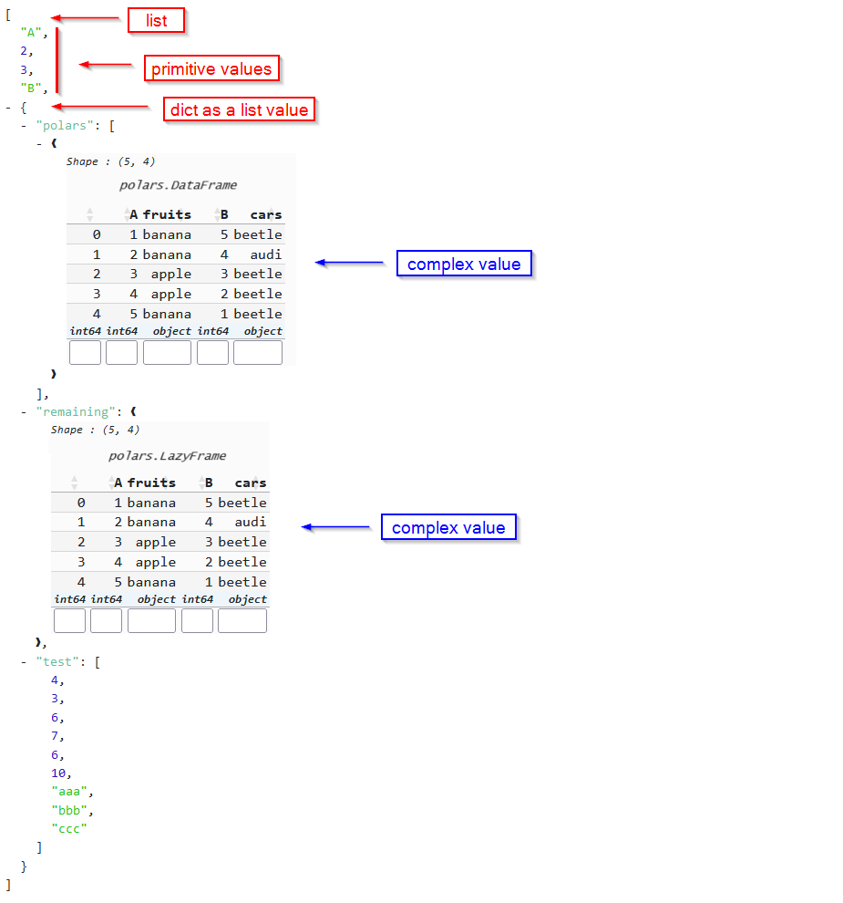
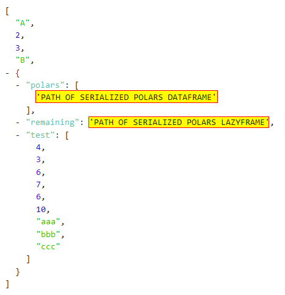
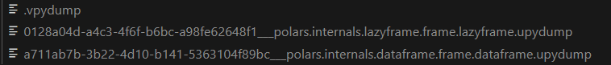
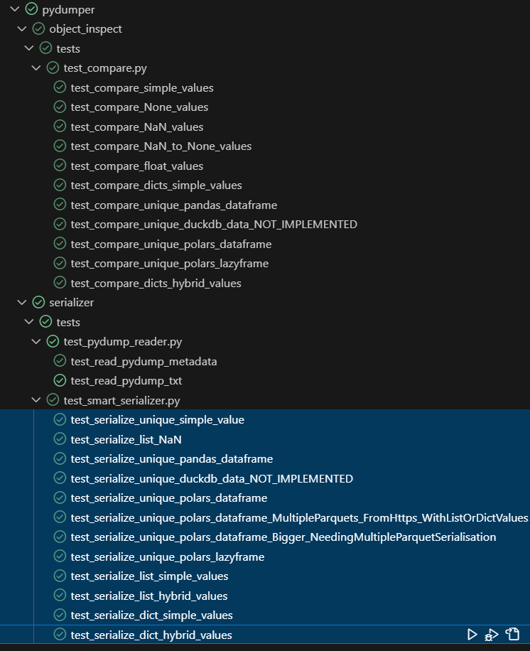

# SmartPyDumper

SmartPyDumper is a Smart Serializer that can serialize and de-serialize any json-like data that can contains any combination of Frame-like Data (Pandas DataFrames, Series, Polars DataFrame, LazyFrames, etc).

## Context

Let's take an inventory of the existing serialization mechanisms in Python:
- It is easy to serialize/deserialize any complex frame-like data variable (Pandas DataFrame, Polars DataFrame, etc.) using the native write/read mechanisms offered by these libraries.
- We can serialize/deserialize any json-like data : any combinations of list/dict/tuples containing "simples" data. This is for example the case with the excellent [json package](https://docs.python.org/fr/3/library/json.html).
- However, when the list/dictionary itself contains "complex" (non-naively serializable) values like Pandas DataFrames, this becomes [less easy to achieve](https://www.google.com/search?q=dump+dict+python+containing+pandas). However, this remains feasible, particularly with the excellent [dill package](https://github.com/uqfoundation/dill).
- Unfortunately, if the list/dictionary contains even more complex values, like Polars DataFrame, packages like dill does not allow serialization.

However, the existence of a robust serialization mechanism compatible with the usual frame-like data would be of crucial interest in Data Engineering, particularly in the case of Data Pipeline Building, where it is necessary to serialize/deserialize all intermediate data between each step, to ensure idempotence, and be able to restart any pipeline from any step in case of failure.

That's why this project offers **a flexible serialization mechanism, that can serialize list/dict/tuples containing any type of common data used in Data Engineering, and extendable to take into account other future data typologies** by implementing additional mechanisms without breaking old ones.

## Installation

> pip install SmartPyDumper

## Usage

```python
import SmartPyDumper.serializer.smart_serializer as ss

mydata=[...]

# Seralize
ss.serialize(data, '/pydump_data/mydata') # ensure folder is existing

# Deserialize
mydata=ss.deserialize('/pydump_data/mydata')
```

Here is a full example demonstrating the serialization/deserialization of a python dict containing hybrid content.

```python
import SmartPyDumper.serializer.smart_serializer as ss
import pandas as pd
import polars as pl
import numpy as np
import duckdb

# Define output folder
# make sure serialization folder is existing
SERIALIZATION_FOLDER='temp/ex_data'

## Below, `ex_data` is a dict 
#   containing lists 
#       containing Pandas DataFrame, 
#                  Polars DataFrame,
#                  Polars LazyFrame,
#                  duckdb data converted to Polars

# Prepare simple Pandas DataFrame
pd_df=pd.DataFrame({'aa':[np.nan,2,3], 'bb':[7,1/3,8]})
# Prepare simple Polars DataFrame
pl_df=pl.from_pandas(pd_df)
# Prepare simple Polars LazyFrame
pl_lf=pl_df.lazy()
# Prepare simple Polars DataFrame from duckdb
pl_duckdb=duckdb.sql("SELECT * FROM read_parquet('https://duckdb.org/data/prices.parquet');").pl()

# Prepare json-like variable containing hybrid data
ex_data={
        'AA':[1,2,3,4, {'a':8, 'b':np.nan}],
        'BB':[pd_df, pd_df.sum()],
        'CC':{
            'polars_df':pl_df,
            'polars_lf':pl_lf,
            'duckdb':pl_duckdb,
            'param':1/3,
        }
}

print(ex_data)
ss.serialize(ex_data, SERIALIZATION_FOLDER)

# [...]

deserialized=ss.deserialize(SERIALIZATION_FOLDER)
print(deserialized)
```

Many different use cases are given in the form of unit tests (pytest) in **SmartPyDumper.serializer.tests.test_smart_serializer.py**.

## Internal mechanism

### Serialization

The proposed serialization mechanism is based on several underlying mechanisms, some of which were developed for this specific occasion, in particular to allow unit tests implemented to check correct operation.

However, the core implementation of the serialization and deserialization mechanism is located in [this specific module](SmartPyDumper/serializer/smart_serializer.py).

In the most complex case, a Python variable in a Data-usage context could seems like below : 

(this is a purely illustrative example which is of no interest in terms of use.)

This example show a variable that is basically a list, which contains itself some dictionnaries, themselves containing some basic/simple/primitives values, and some Polars complex values.

Because of the presence of those complex values, this variable is not natively serializable, as explained in [Context introduction](#context).

Serializer can't know in advance what kind of Data are present in the dict/list. So the principle is the following : 
- It recursively iterates/travels over each node of the dict/list data
    - If it encounters a simple object, it does nothing in particular during traveling
    - If it encounters a complex object, it serializes it via an appropriate function, and it replaces the object with the path leading to its serialization (path which is a string object, therefore natively serializable)
- At the end of the travel, the variable internally seems like below, so it can be serialized using classic package like [dill](https://github.com/uqfoundation/dill)



### Serialization representation

In a complete case like above, the serialized representation of the data is a folder containing :


- An unique *.**v**pydump* corresponding to serialization of json-like data. It's like an "entrypoint" of serialized **v**ariable to later deserialization. Internally, this file contains :
    - Direct serialization of all "simple" data like int, float, datetime, etc : all data that can be serialized in a quasi-native way.
    - Path to each "complex" serialized object, which need to be serialized alone via a dedicated mechanism (see below).

    Typically, *.**v**pydump* content seems like below : 
    

- Multiple **.**u**pydump* corresponding to serialization of each "complex" **u**nit object found in json-like variable. Each file path is encoded with an unique uuid and information about variable type, allowing SmartPyDumper to deserialize it correctly later. 

If the variable to serialize is an unique variable or a json-like variable that contains only simple data, the serialized representation will consists of an unique .vpydump file.

### Deserialization

The deserialization algorithm briefly works as follows:
- Deserialization of the **.vpydump** file (aka entrypoint) to reconstruct the global structure of the variable, in principle in the form of json-like data (list/dict/tuples).
- Recursive iteration of each object of the json-like variable.
- If the object corresponds to a file path **.upydump** (therefore a complex unit object previously serialized), SmartPyDumper deserializes the file.
- Otherwise, the object is already ready for use
- At the end of the travel, the variable was reconstituted identically to its state before serialization

## Features

- Support serialization and deserialization
- Support any kind of json-like data : dict/list/tuples
- Support common frame-like data : pandas, polars, ~duckdb (use need to convert to polars first)
- Suppor np.NaN and None values

## Hidden features

### Smart Comparison

The comparison action suffers from the same limitations as those described regarding the serialization mechanisms discussed in the context section.

Basically, no package currently provides a robust way to recursively compare two variables in order to highlight possible differences in the entire hierarchy of dictionaries/lists and frame-like data that may compose them.
Indeed, in the best case we can only compare pandas dataframes with each other, or lists/dictionaries containing simple objects (see [deepdiff](https://github.com/seperman/deepdiff)), but not their combinations.

However, for the purposes described in the [section concerning unit tests](#unit-testing), such functionality was necessary and therefore has been developed "at a minimum" in addition to the present project. This draft module [compare](/SmartPyDumper/object_inspect/compare.py) allows smart comparison of any json-like variables containing any complex frame-like data, using **SmartCompare** class.

In the example below, SmartCompare can detect a difference that occurs in a specific row of a specific column of a DataFrame itself contained in a value of a dict.

```python
data_A={
    'AA':[1, 2, 3, 'a', 'b', 'c', None],
    'BB': pd.DataFrame({'aa':[1, 2, 3]})
}
data_B={
    'AA':[1, 2, 3, 'a', 'b', 'c', None],
    'BB': pd.DataFrame({'aa':[1, 2, 5]}) 
             # 5 instead of 3 ---- ^^^
}

are_equals=SmartCompare(data_A, data_B).identical
# are_equals will be False
```

This module itself benefits from significant coverage in terms of unit tests, concerning the *SmartCompare(a, b).identical* functionality: allowing you to compare 2 variables a and b regardless of their typology, and to return True if the two variables are identical, False otherwise.

Underlying this functionality is based on a mechanism listing all the differences listed during the recursive comparison. This mechanism is functional in substance, but not yet optimal in form : it does not guarantee to provide a homogeneous result in terms of restitution format, which could allow any automated exploitation.

When a homogeneous restitution format has been determined and implemented, the entire module will certainly be externalized in a package and a dedicated git, in which more information will be provided.

### Pydump reader

Since the serialized representation of data made by Pydump is fundamentally relatively simple (as described in [Serialization Representation](#serialization-representation)), it is possible to implement any reading function allowing the content of this serialization to be visualized in different forms, making any data inspection mechanism possible in any tool that might need it.

For this, Pydump provides two base classes in [Pydump Reader](/SmartPyDumper/serializer/pydump_reader.py):
- PydumpVarReader: "entrypoint" reader, which allows reading a given serialized variable.
- PydumpUnitReader: which implements how to read each unit object containing in the variable.

In the provided standard classes, a basic txt rendering feature is implemented, but you can implement yours by creating your own classes inherited from the standards ones.

```python
import SmartPyDumper.serializer.smart_serializer as ss
from SmartPyDumper.serializer.pydump_reader import PydumpVarReader

# [...]

ss.serialize(data, DATA_FOLDER)
var_reader=PydumpVarReader(DATA_FOLDER)

# print metadata without having to really open and read serialized data
print(var_reader.metadata)

# print txt representation of the data
print(var_reader.render_txt())
```

## Unit Testing

A significant amount of unit tests were implemented to ensure proper functioning of the serialization/deserialization mechanism in various use cases. These tests may be improved later to obtain even wider coverage.

All tests are available in [this location](/SmartPyDumper/serializer/tests/test_smart_serializer.py).



The principle of operation of all tests is as follows:
- Constitution of a variable to be serialized, representing an use case
- Conservation of this variable: original variable
- Serialization of the variable using the SmartPyDumper module
- Reconstruction of the original variable from its serialized representation: deserialization of the variable
- Comparison of the original variable and its reconstruction, by using [Smart Comparison functionnality](#smart-comparison)
- If both are identical, the serialization/deserialization mechanism is considered functional for this use case

## Limits ⚠️
- For now the serialization natively handle only local serialization/deserialization, but it should be usable using volume point mount, see [TODO](#todo).
- This serializer is not natively designed to handle kind of variable that are not common use in a Data Engineering context. It's a robust serializer specialized in Data Engineering use cases.
- Frame-like variables that containing complex data at cell-level may be not fully compatibles. 

## TODO

- Add native support to usal point mounts.
    - First approach : handle mounting at python-level
        - S3 : https://github.com/fsspec/s3fs
        - Blob : https://github.com/lkarjun/mount-azure-blob-storage/
        - ...
    - Second approach : handle mounting at docker-level
        - Each volume can be mount to external storage
- Improve **object_inspect.compare** module outputs and externalize it into a dedicated python package
- Improve Pydump Reader extending feature, by hiding travel processing and just defining rendering implementation of each object type